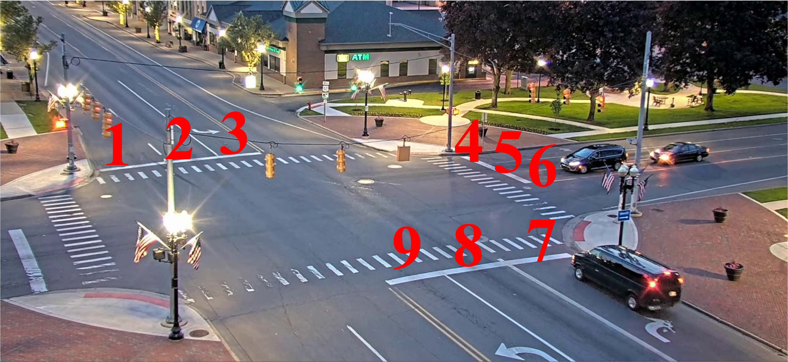
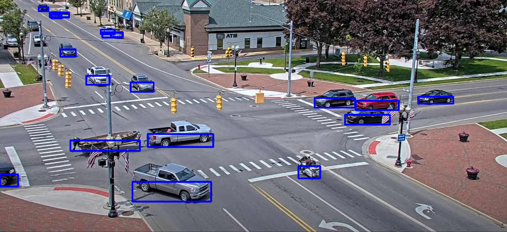

# Occupied-Car-Lane-Detection
Application utilizing Computer Vision to detect car occupancy in lanes from images obtained through a stationary camera

The project is created to run on the intersection above, as the lane coordinates are hardcoded.

## Workflow

The workflow is as follows:

1. use YOLOv5 to detect all vehicles in the following classes: "car","truck","bycicle","motorcycle","bus"
2. halve the weight of the resulting bounding boxes (this is especially important for lanes 3, 4 and 5 due to vehicles overlapping multiple lanes)
3. for each vehicle detected, for each lane, calculate the intersection of the area belonging to the lane and the area belonging to the bounding box of the car and divide by the area of the bounding box. This is the "lane score" for the car
4. the car then gets assigned to the lane with the highest lane score
5. if the lane score is lower than 0.1 (a tiny fraction of the bounding box of the car is touching the lane) the assignment is discarded. This is done to prevent cars outside of lanes causing false positives
6. lanes with assinged cars are marked as occupied (1), otherwise 0

## Input

An example of an input image is the following:

The app expects a .txt file in the following format (see input "example_query.txt" for example):

* First row is the number of lanes to query
* Following rows containing a single number representing the lane index

## Output

An example of an input image is the following:

To view the output image, 'show_im' must be set to True when calling the checkLanesQueries function.

The output is a .txt file in the following format (see results "example_image_predicted.txt" for example):

* First row is the number of lanes to query
* Following rows containing a single number representing the lane index, along with the occupised status, 0 - free, 1 - occupied

