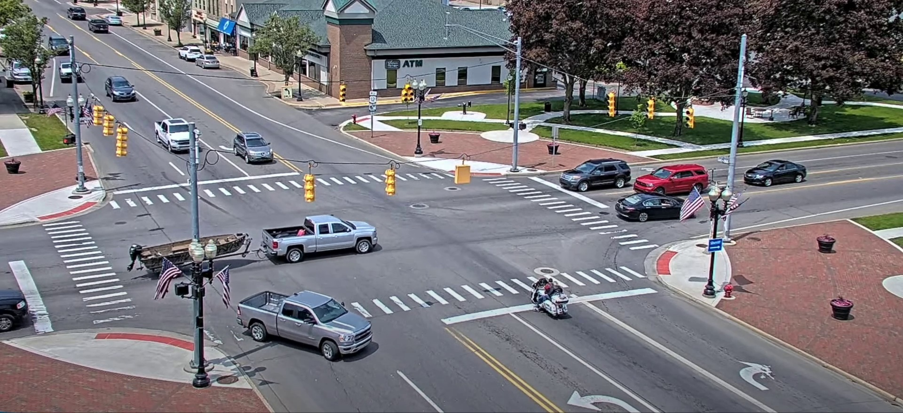

# Occupied-Car-Lane-Detection
Application utilizing Computer Vision to detect car occupancy in lanes from images obtained through a stationary camera

The project is created to run on the intersection above, as the lane coordinates are hardcoded.

## workflow

The workflow is as follows:

1. use YOLOv5 to detect all vehicles in the following classes: "car","truck","bycicle","motorcycle","bus"
2. half the weight of the resulting bounding boxes (

